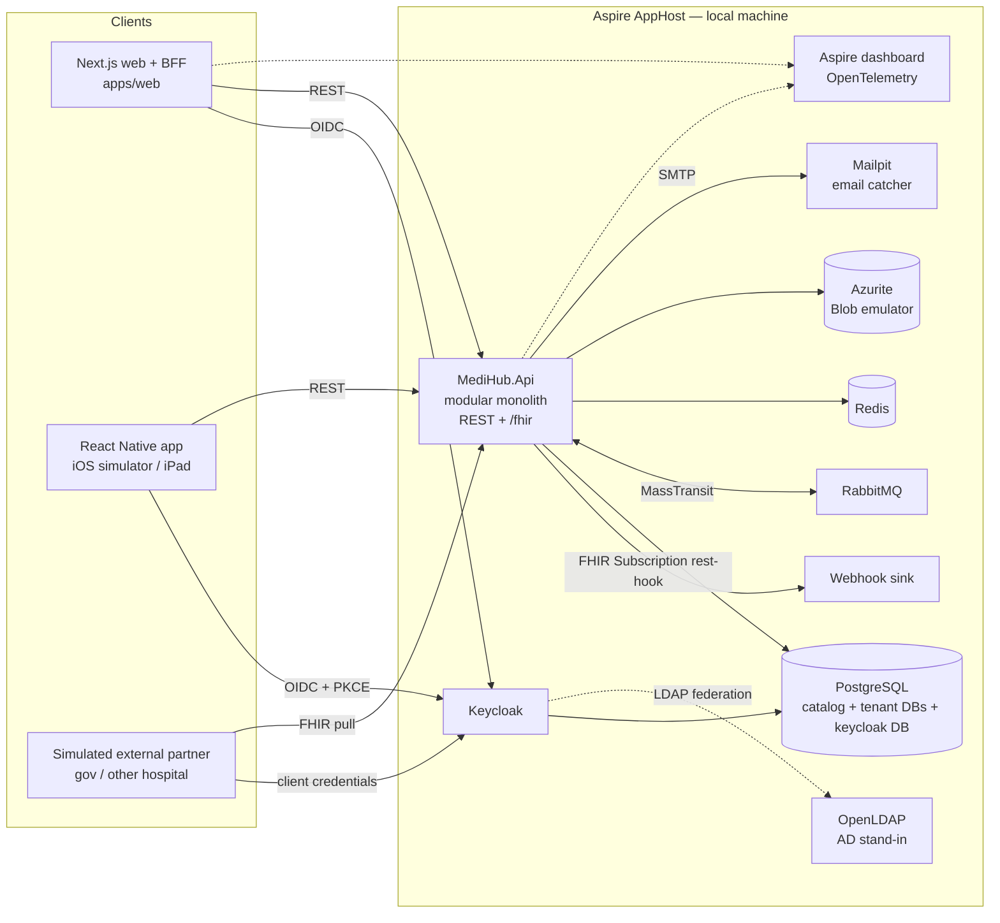

# Hospital Management System — High-Level Architecture

> **Living document.** It covers the technology stack and the **development
> environment** only. The production environment will get its own document
> later. Sections carry the same status markers as [`intent/intent.md`](../intent/intent.md)
> (`exploratory` | `emerging` | `settled`; see [`intent/README.md`](../intent/README.md)).
>
> Each item is marked **Decided** (stated or confirmed by the project owner) or
> **Proposed** (a suggestion that still needs confirmation). Proposed items
> must not be treated as settled until they are confirmed, ideally through an ADR.

## 1. Scope and architectural drivers

_Status: emerging_

This document describes the building blocks of the Hospital Platform (see
intent §1) and how a developer runs them locally. Production topology, scaling,
HA/DR, networking and cost are out of scope here.

The drivers below shape every choice in this document:

| Driver | Consequence | Status |
| --- | --- | --- |
| Product for **hospital groups in the EU**, not SaaS | GDPR (health data is special-category data), EHDS, NIS2. EU data residency. | Decided |
| **One backend deployment per hospital group**, multi-tenant (tenant = hospital) | Tenant context everywhere. A group-level administrator governs tenants and central data. | Decided |
| **Database per tenant** | A central tenant catalog plus one database per hospital. Migrations and the outbox must work across all tenant databases. | Decided |
| **Tenant switching** for staff who work in several hospitals | Active tenant carried in the token. Roles scoped per tenant. | Decided |
| **Application-level encryption** of personal data at rest | The application encrypts and decrypts. It is the standard pattern for all modules. | Decided |
| **Clinical-grade audit**, including read access | Audit is a platform capability, not per-module code. | Decided |
| **Authorization beyond roles** | Attribute- and relationship-based rules (tenant, ward, care relationship, consent, break-the-glass). | Decided (engine not yet chosen) |
| **HL7 FHIR via a facade** | FHIR is the exchange format, not the internal model. | Decided |
| **EMPI** following standards | IHE PIXm/PDQm and FHIR `$match`. Cross-tenant patient identity. | Decided (design open) |
| Imaging (PACS/DICOM), lab and device integration | Out of scope | Decided |

## 2. Technology stack

_Status: emerging_

### 2.1 Repository and build

| Concern | Choice | Status |
| --- | --- | --- |
| Repository | Monorepo | Decided |
| Task orchestration | **Nx**, running both .NET and Node projects (`affected`, caching, module-boundary rules) | Decided |
| JS package manager | **npm workspaces** | Decided |
| .NET Nx integration | Nx .NET plugin (official `@nx/dotnet`; community `@nx-dotnet/core` as fallback) | Decided |
| .NET solution and packages | `.slnx` solution, `Directory.Build.props`, Central Package Management (`Directory.Packages.props`), SDK pinned in `global.json` | Decided |

### 2.2 Backend

| Concern | Choice | Status |
| --- | --- | --- |
| Runtime | **.NET 10** (LTS) | Decided |
| Architecture | **Modular monolith**, event-driven | Decided |
| Local orchestration | **Aspire** (AppHost and ServiceDefaults) | Decided |
| Messaging | **MassTransit** over **RabbitMQ**. Commercial licence accepted. | Decided |
| Persistence | PostgreSQL with EF Core (Npgsql). **One schema per module** inside each tenant database; migration history kept per schema. | Decided |
| Caching | **Redis** with .NET **HybridCache** | Decided |
| Search | Plain SQL (Postgres) for now; no search engine | Decided |
| FHIR | **Facade** in a dedicated Interoperability module using the Firely .NET SDK | Decided |
| Internal patterns | Defined by the backend skills in `.claude/skills/dotnet-backend-modular-monolith-*` (summarised below) | Decided |
| Module structure | 5 projects per module: Domain, Application, Infrastructure, IntegrationEvents, Presentation | Decided |
| CQRS | **MediatR** commands and queries returning `Result<T>`; pipeline behaviours for logging and validation | Decided |
| Validation | **FluentValidation**, wired through a MediatR validation behaviour | Decided |
| Mapping | **Mapster** | Decided |
| HTTP endpoints | **Minimal APIs** in each module's Presentation project, mapped centrally by the API host | Decided |
| Outbox | Domain events stored as `OutboxMessage` rows in the same transaction (EF Core interceptor). A **Quartz** job dispatches them to domain event handlers, which publish to MassTransit. | Decided |
| Distributed workflows | Choreography (consumers reacting to events) or orchestration (MassTransit state-machine sagas with EF Core persistence), chosen per feature | Decided |
| Migrations | A dedicated **migration service** (`MediHub.MigrationService`) migrates the catalog and every tenant database. Aspire runs it before the API; the API never migrates. | Decided |
| API reference | **Scalar**, generated from the same OpenAPI document that feeds orval | Decided |

### 2.3 Web frontend

| Concern | Choice | Status |
| --- | --- | --- |
| Framework | **Next.js** (App Router) | Decided |
| UI | **shadcn/ui** and **Tailwind CSS** | Decided |
| Server state | **TanStack Query** | Decided |
| HTTP client | Client generated from the backend OpenAPI spec with **orval**, producing TanStack Query hooks on top of `fetch` | Decided |
| Client-only state | **TanStack Store**, only where needed | Decided |
| Authentication pattern | Backend-for-frontend (BFF): **Auth.js** with Keycloak, so tokens never reach the browser | Decided |

### 2.4 Mobile and iPad

| Concern | Choice | Status |
| --- | --- | --- |
| Framework | **React Native** | Decided |
| Toolchain | **Expo** (development builds) | Decided |
| UI | **NativeWind** and **react-native-reusables** (shadcn-style), sharing Tailwind tokens with web | Decided |
| Offline mode | Not required | Decided |
| Authentication | OIDC **Authorization Code with PKCE** | Decided |
| Token and cache handling | Tokens in secure storage; query cache never persisted | Proposed |

### 2.5 Identity and access

| Concern | Choice | Status |
| --- | --- | --- |
| Identity provider | **Keycloak** | Decided |
| Staff authentication | Hospitals' **Active Directory**, federated through Keycloak | Decided |
| Tenant model in Keycloak | Single realm with **Organizations**, one organization per hospital; active organization carried in the token | Decided |
| Tenant resolution in the API | From the validated token claim only, never from a client-supplied header | Decided |
| Authorization requirements | **Granular permissions**, assigned at **runtime** by **hospital-level administrators**, and **easy to configure** | Decided |
| Runtime role configuration | In an admin UI, a **hospital administrator**: bundles permissions into roles (e.g. "Ward Nurse", "Pharmacist"); assigns roles to staff in **their own hospital only**; can optionally narrow an assignment to a **ward or department**. Changes take effect **immediately**, with no new release and no re-login. | Decided |
| Authorization engine | In-app permission model in the Access module: permission catalog declared in code by each module; roles and assignments stored per tenant; checks done server-side and cached (not carried in the token); contextual rules in code. No external policy engine. | Decided |
| Approval of permission grants | No second approval; a hospital administrator's assignment applies directly | Decided |
| List filtering | Lists return **only the records the user is allowed to see**, by default. The filter is applied inside the database query (so paging and counts stay correct), never by trimming results in memory. | Decided |
| Field-level visibility | The same endpoint can return **more information to some users than others**. Extra fields are gated by permissions and omitted for users without them. Which fields or data categories are gated is decided during grooming. | Decided (rule); field list per requirement |
| External partners | **Keycloak confidential clients** (client credentials with `private_key_jwt`), scoped per tenant and purpose | Decided |

### 2.6 Cross-cutting platform capabilities

| Concern | Choice | Status |
| --- | --- | --- |
| Encryption of personal data | Application-level envelope encryption: AES-GCM, a data key per tenant wrapped by a master key, applied through EF Core value converters. Blind indexes for exact-match lookups. Which fields are encrypted is decided per requirement during grooming. | Decided (pattern); field list per requirement |
| Email notifications | Email (Brevo in production) | Decided |
| Push notifications | Firebase Cloud Messaging | Decided |
| Notification content | **No clinical data** in email or push content. Send a link, or a prompt to open the app. | Decided |
| Personal data in notifications | Excluded **by default**. Exceptions are decided per notification type (e.g. a first name is acceptable in an email). | Decided (rule); exceptions per notification type |
| Clinical audit | Design to be settled in a separate discussion (candidate: FHIR `AuditEvent` model / IHE BALP, append-only) | Deferred |
| Observability | OpenTelemetry everywhere. Aspire dashboard locally (Grafana in production). | Decided |
| Secrets | Local developer secrets (Azure Key Vault in production) | Decided |
| Document storage | Azure Blob Storage | Decided |

## 3. Logical architecture

_Status: emerging_

### 3.1 Modular monolith

One deployable backend host (`MediHub.Api`) composes all modules. Each module (Decided, per the backend skills):

- owns its data: its own schema in each tenant database, and no other module reads it directly;
- consists of five projects: **Domain**, **Application**, **Infrastructure**, **IntegrationEvents** and **Presentation**. Dependencies point inward (Presentation → Application → Domain; Infrastructure implements inner-layer interfaces);
- talks to other modules **only through integration events and saga commands** on RabbitMQ (MassTransit). There are no direct calls and no shared DbContexts. Another module may reference only its `IntegrationEvents` project (a pure contract library);
- raises domain events that reach the broker through the outbox (§2.2), so a saved change and its event are never out of step.

Architecture tests that enforce these boundaries (NetArchTest or ArchUnitNET), backed by Nx module-boundary rules on the TypeScript side, are proposed.

Integration events, saga commands, domain events (stored in outbox rows) and saga state carry **identifiers, not personal data**. This follows from application-level encryption, because queues and outbox tables are data at rest too. A consumer that needs more detail asks the owning module with **MassTransit request/response**. (Decided.)

**Platform modules** (proposed). Business modules are not listed: they are derived from groomed requirements, not decided up front.

| Module | Responsibility |
| --- | --- |
| Tenancy | Tenant catalog, onboarding, tenant database routing, group-level administration |
| Access | Permission catalog, hospital-configured roles and assignments (optionally scoped to ward or department), authorization checks, break-the-glass, consent enforcement |
| Audit | Clinical-grade audit trail, including read access |
| Interoperability | FHIR facade, FHIR Subscriptions (webhooks), EMPI-facing operations, government and partner integrations |
| Notifications | Email and push delivery behind provider-neutral interfaces |

### 3.2 Multi-tenancy

```
Central:    tenant catalog DB   → tenants, connection info, key references, group-level data (scope: open)
Per tenant: medihub_<tenant> DB → one schema per module, outbox/inbox tables, module data
```

- Tenant context travels through every hop: HTTP requests, MassTransit message headers, background jobs, HybridCache keys and database connections.
- **Open: outbox delivery across tenants.** The outbox processor (`OutboxMessageProcessor<TDbContext>`) works per database. With database per tenant it must cover *every* tenant database without double delivery when several API replicas run. Deferred, to be revisited with the project owner; prototype early.
- Group-level central data (EMPI, terminology, staff directory, shared master data) is **open** and will be defined during grooming.

### 3.3 Tenant switching

1. The user signs in through Keycloak. The token lists the hospitals they belong to.
2. The user picks the active hospital. The client requests a token scoped to that organization.
3. The API resolves the tenant from the token and checks the user's roles *for that tenant*.
4. The UI always shows the active hospital. TanStack Query cache keys include the tenant (or the cache is cleared on switch).
5. Every audit event records both the user and the active tenant.

### 3.4 FHIR facade and external partner access

The Interoperability module turns domain data into FHIR resources on request and
stores no second copy. It serves two kinds of access for **authorized external
parties** (government systems, other hospitals; e.g. patient repatriation):

| Mode | Mechanism | Status |
| --- | --- | --- |
| **Pull** | FHIR REST API (`/fhir/...`). Partner authenticates as a Keycloak confidential client. Each request is authorized (tenant, purpose, consent) and audited. | Decided |
| **Push (webhooks)** | FHIR topic-based **Subscriptions** (R5 Backport IG on R4), `rest-hook` channel, **ID-only payloads**. The partner then pulls the resource with its own authorization. Triggered by domain events on RabbitMQ. | Decided (webhooks for authorized parties); Proposed (mechanism) |

Profiles (IPS, HL7 Europe, national profiles), operations and search parameters
are added as requirements need them. The `CapabilityStatement` publishes exactly
what is supported. The first target country is **open**.

### 3.5 Encryption flow

```
write: domain value → EF Core value converter → AES-GCM with the tenant's data key → ciphertext (+ key version) → Postgres
read:  Postgres → ciphertext → data key (cached in memory, unwrapped by the master key) → plaintext in memory only
```

- The key provider is an abstraction. **Development** uses a local master key from developer secrets; **production** uses Azure Key Vault. The code path is otherwise identical.
- Encrypted columns cannot be searched with `LIKE` or `pg_trgm`. Exact lookups use blind indexes. Fields needed for fuzzy search or EMPI matching are decided field by field.
- Logs, traces and exceptions never contain decrypted values.

## 4. Repository layout

_Status: exploratory (proposed; nothing is bootstrapped yet)_

Backend paths follow the conventions the backend skills expect (`src/Api`, `src/Common`, `src/Modules`).

```
apps/
  web/                         Next.js app (also the BFF)
  mobile/                      React Native (Expo) app for phones and iPad
src/
  Aspire/
    MediHub.AppHost/           Aspire AppHost: the local entry point
    MediHub.ServiceDefaults/   OpenTelemetry, health checks, resilience defaults
  Api/
    MediHub.Api/               Host: composes modules, maps endpoints (REST and /fhir), registers consumers
  Tools/
    MediHub.MigrationService/  Applies migrations to the catalog and every tenant database
  Common/
    MediHub.Common.Domain/          Entity base types, domain events, Result/Error
    MediHub.Common.Application/     CQRS abstractions, pipeline behaviours, repository and unit-of-work contracts
    MediHub.Common.Infrastructure/  MassTransit/RabbitMQ, outbox, tenancy, encryption, persistence base
  Modules/
    <Name>/
      MediHub.Modules.<Name>.Domain/
      MediHub.Modules.<Name>.Application/
      MediHub.Modules.<Name>.Infrastructure/
      MediHub.Modules.<Name>.IntegrationEvents/
      MediHub.Modules.<Name>.Presentation/
tests/                         Unit, integration (Testcontainers / Aspire testing), architecture tests
packages/
  api-client/                  Generated by orval from the backend OpenAPI spec; shared by web and mobile
  ui-tokens/                   Tailwind design tokens shared by web and mobile
  tsconfig/  eslint-config/
infra/
  keycloak/                    Realm export (demo hospitals, users, clients)
  postgres/                    Init scripts (catalog and tenant databases)
intent/  discovery/  architecture/
MediHub.slnx  Directory.Build.props  Directory.Packages.props  global.json
nx.json  package.json (npm workspaces)  .nvmrc
```

## 5. Development environment

_Status: emerging_

### 5.1 Principle

**One command starts everything.** The Aspire AppHost starts the infrastructure
containers, the backend and the web app. The Aspire dashboard shows logs, traces
and metrics for all of them. Nx wraps this so that .NET and Node tasks share one
interface.

### 5.2 Local topology



### 5.3 Local resources

The production column only maps each resource to its counterpart. Production
design belongs to the later production document.

| Resource | Local implementation | Purpose | Production counterpart | Status |
| --- | --- | --- | --- | --- |
| Backend | `MediHub.Api` (.NET project, run by AppHost) | Modular monolith host | Azure Container App | Decided |
| Web | `apps/web` (Next.js dev server, run by AppHost) | Web UI and BFF | Azure Container App | Decided |
| Mobile | `apps/mobile` (Expo dev server via Nx) | Phone and iPad app | App Store / Play Store builds | Decided |
| Database | PostgreSQL container with a persistent volume. Databases: `keycloak`, `medihub_catalog`, `medihub_<tenant>` for each demo hospital. | All relational data | Azure Database for PostgreSQL Flexible Server | Decided |
| Message broker | RabbitMQ container with management UI | Integration events | RabbitMQ as an Azure Container App | Decided |
| Cache | Redis container | HybridCache second-level cache | Azure managed Redis service | Decided |
| Identity | Keycloak container with a realm imported from `infra/keycloak` | Login, tenant organizations, partner clients | Keycloak as an Azure Container App | Decided |
| Directory | OpenLDAP container (AD stand-in), or Keycloak local users only | Exercise LDAP federation locally | Each hospital's Active Directory | Proposed |
| Blob storage | Azurite emulator | Documents and attachments | Azure Blob Storage | Proposed (Azurite) |
| Email | Mailpit container (SMTP catcher with web UI) | Inspect outgoing email | Brevo | Proposed (Mailpit) |
| Push | Logging sender by default; optional Firebase **dev** project | Avoid sending to real devices by accident | Firebase Cloud Messaging | Proposed |
| Webhooks | Local webhook sink container | Inspect FHIR Subscription notifications | Partner endpoints | Proposed |
| Secrets and keys | .NET user-secrets / Aspire parameters; local dev master key | Connection strings, encryption master key | Azure Key Vault | Decided (no Key Vault locally) |
| Observability | Aspire dashboard (OTLP) | Logs, traces, metrics | Grafana | Decided |

### 5.4 Demo data

Proposed: development and test environments only ever contain **synthetic data**
(e.g. patients generated with Synthea), never real patient data. This also
protects AI agents working in the repo from handling real personal data.

Proposed seed set:

- two demo hospitals (tenants) in one demo hospital group;
- users: a single-hospital nurse, a doctor working in **both** hospitals (to exercise tenant switching), a group administrator;
- one external-partner client (simulated government system) with FHIR pull access and a webhook subscription.

### 5.5 Prerequisites (proposed)

| Tool | Notes |
| --- | --- |
| Docker Desktop (or Podman) | Container runtime for Aspire |
| .NET 10 SDK | Pinned in `global.json` |
| Aspire CLI | `aspire run` |
| Node.js (active LTS) and npm | Pinned in `.nvmrc` and `package.json` `engines` |
| Xcode (macOS) | iOS simulator and iPad testing |
| Android Studio | Optional: Android emulator |

### 5.6 Developer workflow (target, once bootstrapped)

```bash
npm install                    # JS dependencies for all workspaces
dotnet tool restore            # local .NET tools
npx nx run apphost:serve       # or: aspire run — starts infra, API and web
npx nx run mobile:start        # Expo dev server for simulator / device
npx nx affected -t lint test build   # only what changed
```

Mobile networking notes: the iOS simulator reaches the host on `localhost`. The
Android emulator uses `10.0.2.2`. Physical devices need the machine's LAN
address, and matching redirect URIs in Keycloak.

## 6. Open items

_Status: exploratory_

| Item | Why it matters | Where it gets resolved |
| --- | --- | --- |
| Production environment | Hosting topology, networking, HA/DR, RabbitMQ persistence and clustering on Container Apps, cost | Separate production architecture document |
| Group-level central data | Decides what lives in the catalog vs tenant databases; shapes EMPI | Requirement grooming |
| Fields that get application-level encryption | Trade-off against SQL search and EMPI matching | Requirement grooming, per field |
| Permission-gated fields and categories | Which fields or data categories (e.g. mental health, HIV status) are visible to which users | Open for discussion during requirement grooming |
| Multi-tenant outbox delivery | Outbox processor across many tenant databases, without double delivery across API replicas | Deferred: revisit with project owner, then prototype and ADR |
| First target country | National FHIR profiles, government systems, legal retention periods | Discovery |
| AD in development | OpenLDAP stand-in vs Keycloak local users | Decide at bootstrap |
| Clinical audit design | Model, storage and what counts as an auditable read | Separate discussion |
| Personal data in request/response payloads | Responses may carry personal data through RabbitMQ; decide whether they need encrypting in transit | Production architecture document |
| Cross-cutting concerns (testing strategy, i18n, accessibility, DevSecOps gates) | Deferred by the project owner | Later discussion |

## 7. Architecture Decision Records

The reasoning behind the **Decided** items above is recorded in
[`adr/`](adr/README.md) (intent §2: ADRs). A change to a decided item needs a
new ADR that supersedes the old one.

| ADR | Decision |
| --- | --- |
| [0001](adr/0001-monorepo-nx-npm-workspaces.md) | Monorepo with Nx and npm workspaces |
| [0002](adr/0002-modular-monolith-aspire-masstransit-rabbitmq.md) | Modular monolith with Aspire, MassTransit and RabbitMQ |
| [0003](adr/0003-backend-internal-patterns.md) | Backend patterns: CQRS with MediatR, outbox with Quartz, choreography vs saga orchestration |
| [0004](adr/0004-database-per-tenant.md) | Database per tenant with a central catalog |
| [0005](adr/0005-keycloak-ad-federation-tenant-switching.md) | Keycloak with AD federation and tenant switching |
| [0006](adr/0006-application-level-encryption.md) | Application-level encryption of personal data at rest |
| [0007](adr/0007-fhir-facade.md) | FHIR facade (rather than a FHIR server), with Subscriptions for authorized partners |
| [0008](adr/0008-notification-providers.md) | Notification providers: Brevo for email, Firebase for push |
| [0009](adr/0009-in-app-granular-authorization.md) | Authorization: in-app granular permissions with runtime, hospital-configured roles |
| [0010](adr/0010-frontends-shared-generated-api-client.md) | Next.js and React Native frontends with a shared generated API client |

Still to be recorded as ADRs once settled: multi-tenant outbox delivery,
clinical audit design, and the production hosting decisions (with the
production architecture document).
